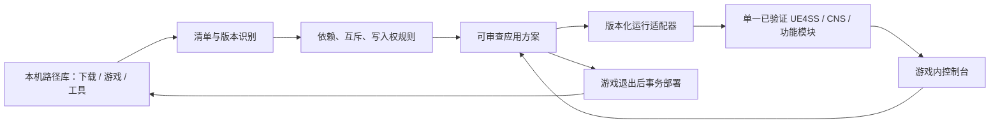

# 架构与兼容规则

读者为实现者；在技术实验、版本变化或新增适配器时更新。本页是候选方案，未实现。

## 一个入口，分开执行职责

- **catalog**：区分下载包、逻辑 MOD、版本、变体、运行组件、选项；路径是位置，hash 是内容标识。识别归档损坏、未完成下载、同 hash 复本、三件套缺失、移动的源路径。
- **policy**：纯规则核心，对所有入口返回依赖闭包、排斥集合、条件和应用方式。前端不可成为唯一校验者。
- **adapters**：每种工具有版本化能力接口；只读发现优先，再定义状态读/参数写/恢复、线程及生命周期。无法适配时明确展示缺口。
- **runtime**：优先自有 Lua + 现有单一 UE4SS 的桥；通过游戏线程调用已验证对象。UI 可用 Lua/UMG 路线，R06 验证后固定。不是建立第二个常驻功能写入器。
- **ui**：模块化总控制台；分类页和功能工具页共享兼容状态、事务和提示。保留能切换页面/布局的扩展点，不嵌套其他软件原窗口。
- **companion**：必要的游戏外路径配置、导入、互斥求解、停机部署和恢复。优先轻量 CLI/现有进程，不为架构加入后台服务、网络端口或新的调度器。

Linux/Proton 为第一真实环境。原生 Windows 是公开版目标平台，单独验收；本轮不假定 Linux 能本地编译 UE4SS C++ 或运行所有 Windows 管理器。只有 UMG 路线实测不能满足要求且收益明确时，才研究独立 C++/渲染覆盖层，依赖构建条件重新确认。

## 路径与数据

配置只保存明确用户选择的 downloads、game、existing_mod_workspace、tools 路径；具体本机值在 .local/paths.json，不提交。公开 config/paths.example.json 使用占位符。未来玩家配置位于自己的系统配置目录，与源码、游戏和第三方包分离。

源 MOD 不移入开发仓库；原包保持只读。安装有三层概念：source、staged、active。游戏需要的最终文件可在用户授权后按适配策略复制/链接到拥有的目标；原来源仍保留。不能假设 Windows/Proton 都能使用任意符号链接或跨盘原子重命名，R04/R16 实测后决定。游戏内不对整个 Downloads 扫描/解包，不加载全量预览。

配置档记录激活集合、依赖版本、游戏/loader版本和验证依据，不携带第三方资产。备份只覆盖本轮将改的精确已知文件；并发修改拒绝覆盖，事务恢复不能回滚用户存档/真实游戏进度。

## 规则类型和范围

| 类型 | 例子 | 系统行为 |
| --- | --- | --- |
| exclusive_variant | Keyhole 三变体、三个 ATOOL、普通/chunk 变体 | 单选；切换移除旧变体而非叠加 |
| hard_conflict | 已证实 Container ID 重复、不支持 DLL ABI | 禁止组合；说明证据与受影响版本 |
| dependency | CNS、身体纹理、DLC、准确 loader 版本 | 解析版本闭包，缺失不能应用 |
| ordered_override | 已验证资源覆盖顺序 | 展示有效提供者；只能使用经验证规则 |
| ownership_conflict | 相机、物理、移动、动画/随机换装同时写同状态 | 指定一个功能拥有者，其他只读/适配 |
| unknown | 新 ESAP/SEAP 关系、未知配置/资源组合 | 标未验证，阻止危险组合自动启用，保留实验入口 |

规则至少覆盖实际安装路径、DLL/Lua 模块、loader 家族、Container/chunk/虚拟资源 ID、CNS UniqueFitID/命名空间、角色和身体/mesh/材质/骨骼/Physics Asset、功能写入权、快捷键、游戏 build、DLC。不能只按 Nexus 页面 ID 判断互斥。

两个可共存的衣服不能因为“都属于服装”就互斥；仅其实际当前槽位/资源/体型配套约束互斥。两个共享文件也不能只因字节不同就断言崩溃；记录覆盖关系与实测。短名、尾缀、加载优先级和改 Container ID 都不是通用兼容证明。

## 操作事务与状态

请求 → 读取当前真实激活集合 → 版本/依赖/互斥/状态校验 → 展示影响 → 准备 → 再检查原像 → 应用 → 回读/验证 → 记录实际状态。失败后保持或恢复原拥有集合，保留原因与方法，不把 UI 已勾选当实际成功。

玩家选择“替换”可主动取消互斥项并调整依赖；选项必须清楚展示将取消什么。自动换装也只能从已验证且配套完整的允许集合选。导入旧配置、快捷键、崩溃恢复必须经过同一 policy，不能绕过。

运行操作先确认当前玩家/世界/actor 有效和安全状态；对战斗、过场、换图、死亡以及销毁中的对象延后/禁用。退出界面恢复已有输入模式，不能粗暴改为 GameOnly 而关闭另一个合法界面。

## 应用能力与适配方向

| 能力层 | 适用条件 | 玩家显示 |
| --- | --- | --- |
| live | 已挂载资源 + 已验证稳定运行 API | 立即应用，失败保持原值 |
| safe_point | 需要角色/场景状态稳定 | 等待安全时机，解释原因，可取消 |
| restart | 普通 PAK/DLL/loader/加载顺序等 | 待重启方案，退出后部署，冷启动验证 |
| unavailable | 缺前置/授权/API/版本证明 | 当前不可用，原因和下一步 |

CNS：研究实例发现、服装枚举、选择与回读；Blueprint→Lua CustomEvent 不能直接假设为 Lua RPC。
EVEExperience/Kittens/UltraCamera：复用当前语义桥和单写入者，按版本公开能力；不能复制未授权脚本。
SEAP/ESAP/Van Dance/ATOOL：先发现实际蓝图函数、输入与动画写入权，逐工具验证。
RandomSwitch：统一调度选择请求与服装允许集合，禁止多个自动换装器抢同一槽位。
桌面 Mod Hub/Control Center/JiggleGUI/Mod Manager：先只读能力映射和配置契约；有稳定合法接口再独立实现游戏内面板，桌面启动按钮只是部分支持。
Trainer：仅适配已授权、可稳定读取的公开接口；任意进程内存注入不在默认架构。

## 发布与扩展

适配器 manifest 将描述版本范围、功能、前置、规则、控制字段、可读/可写、默认值/边界、危险效果、性能证据、来源和许可，R08/R17 冻结真实 schema。不得让第三方导入任意 shell 命令、绝对写入路径或网络服务；只能表达可审核能力。

测试优先合成冲突夹具及公开获许可接口样本；真实资产与本机日志不入库。外部组件固定来源/版本/hash，采用前保留许可；首版不自动更新 loader 或自动下载 Nexus 内容。
